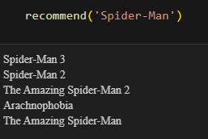

# 🎬 Movie Recommendation System 🍿



> A content-based movie recommender with a clean UI, built using Python.
> Explore your next favorite movie with ease! 🎥✨

---

---

## 📌 Features

- 🔍 Search for any movie you like
- 🎯 Get top similar movies based on content
- 💻 Built using Python with Streamlit
- 📊 Backend ML model with Cosine Similarity
- ✨ Clean & modern UI (Custom CSS styling)
- 🗃️ Uses TMDB 5000 dataset

---

## ⚙️ Tech Stack

- 🐍 Python
- 📚 Pandas, NumPy
- 🧠 Scikit-learn
- 🔎 Cosine Similarity
- 🖼️ TMDB API (for poster images)

---


### 🔤 Text Vectorization

To understand movie similarity, we need to compare movie descriptions (like genres, overviews, cast, etc.) in a way the computer understands. So we:

- Combine features like `title`, `genre`, `keywords`, `cast`, `director` 
- Convert the combined text into numerical format using **CountVectorizer** or **TfidfVectorizer** 🧮
- This results in a **vector** for each movie, representing word frequency or importance ✍️

### 🧭 Cosine Similarity

We calculate the cosine similarity between these vectors:

- Cosine similarity measures the angle between two vectors 📐
- It’s a good choice for text because:
  - It ignores magnitude and focuses on orientation
  - So "Avengers" and "Iron Man" might be far apart in words but very close in meaning ➡️⬅️


---

## 🚀 Getting Started

 📦 Clone the repository

```bash
git clone https://github.com/souravcodes1080/movie-recomendation-system
